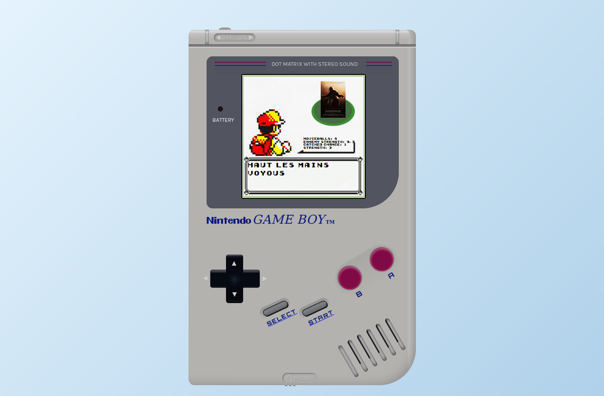

# MovieMon
Ce jeu se nomme MovieMon et son but est de capturer tous les Moviemons qui se cachent sur une grille de jeu en se servant de Movieballs.

Il a ete fait en 2 jour pour le rush00 de la piscine python django de l'ecole 42.

### Technologie
    - Python
    - Django 

### Pour tester (python3)

`virtualenv .`  
`source ./bin/activate`  
`pip3 install -r requirements.txt`  
`python3 manage.py runserver`

